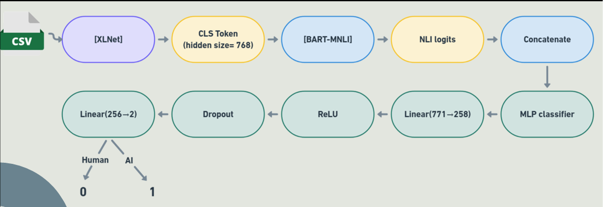
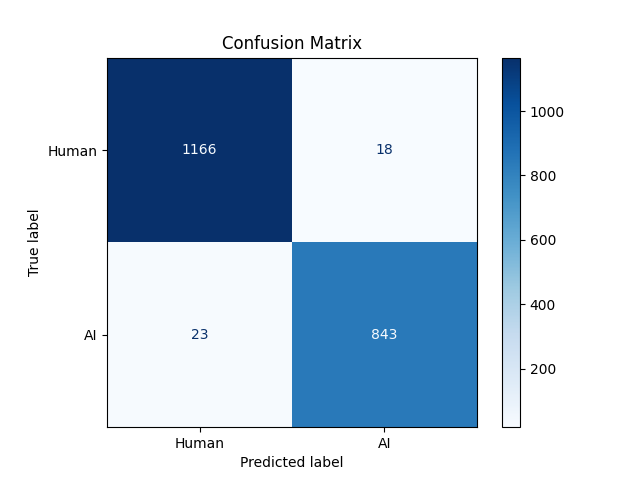

# 🤖 DeepDetect 🤖 : Detecting AI generated text

DeepDetect is an AI generated text detection model, using a hybrid fine-tuned XLNet embeddings with zero-shot classification using BART. 

### 📒 Features

- ✅ Binary classification for Human vs AI-generated text
- ✅ Hybrid model architecture:
  - **XLNet**: Fine-tuned for deep semantic representation
  - **Zero-Shot BART**: For generalized, topic-independent detection
- ✅ Achieves **98% test accuracy**
- ✅ 50-epoch training with 5-fold cross-validation

### Model Architecture ⭐

Fine-tuned XLNet embeddings with zero-shot classification using BART, which leverages the bidirectional learned features of XLnet, and zeroshots’s generalised knowledge across multiple datasets.

### Dataset 📁

[Kaggle](https://www.kaggle.com/datasets/sunilthite/llm-detect-ai-generated-text-dataset) 

Contains 29,000 essays, labeled into two classes: 0 for Human-written, and 1 for AI-generated. It contains 60% human generated essays, and 40% AI generated essays on the same topics.

### Experimentation Details 📊

- Training-test-val split : 70:15:15 
- To avoid data leakage, removed 3200 samples from the training set using cosine similarity between train test val dataset.
- The model was trained for 100 epochs, but stopped training after 46 epochs due to early stopping implementation.  
- Trained using **AdamW** as the optimizer with a **learning rate of 2e-5**, and **CrossEntropyLoss** as the loss function.

### Results 🕵️‍♀️

### Usage 🧑‍💻

- Clone the repository: `git clone https://github.com/your-username/deepdetect.git`
- Install the required packages: `pip install -r requirements.txt`
- Create virtual env : `conda create --name deepdetect python=3.8.5`, and 'conda activate deepdetect' 
- Run `python main.py`

🙌 Got ideas or improvements? Clone this repo, make changes, and send a pull request. Contributions are super welcome! 💪

