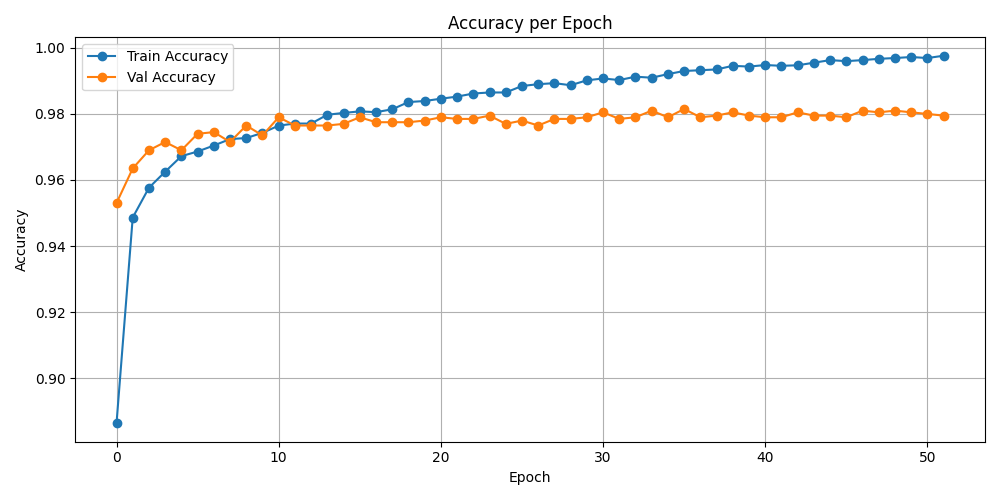

# 🤖 DeepDetect 🤖 : Detecting AI generated text

DeepDetect is an AI generated text detection model, using a hybrid **Fine-Tuned XLNet Embeddings** with **Zero-Shot Classification using BART.** 

## XLnet 🌞

XLNet is an autoregressive pretraining method proposed in the paper “XLNet: Generalized Autoregressive Pretraining for Language Understanding ” [Paper Link](https://arxiv.org/abs/1906.08237). XLNet uses an innovative approach to training. Unlike previous models like BERT, which use masked language modeling (MLM), where certain words are masked and predicted based on context, XLNet employs permutation language modeling (PLM). This means it trains on all possible permutations of the input sequence, enabling it to capture bidirectional context without masking. 

## Zero-Shot learning with BART 🎯

The method works by posing the sequence to be classified as the NLI premise and to construct a hypothesis from each candidate label. For example, if we want to evaluate whether a sequence belongs to the class "politics", we could construct a hypothesis of This text is about politics.. The probabilities for entailment and contradiction are then converted to label probabilities. [Reference](https://huggingface.co/facebook/bart-large-mnli)

## 📒 Features

- ✅ Binary classification for Human vs AI-generated text
- ✅ Hybrid model architecture:
  - **XLNet**: Fine-tuned for deep semantic representation
  - **Zero-Shot BART**: For generalized, topic-independent detection
- ✅ Achieves **98% test accuracy**
- ✅ 50-epoch training with 5-fold cross-validation

## Model Architecture ⭐

Fine-tuned XLNet embeddings with zero-shot classification using BART, which leverages the bidirectional learned features of XLnet, and zeroshots’s generalised knowledge across multiple datasets.

### Dataset 📁

[Kaggle](https://www.kaggle.com/datasets/sunilthite/llm-detect-ai-generated-text-dataset) 

Contains 29,000 essays, labeled into two classes: 0 for Human-written, and 1 for AI-generated. It contains 60% human generated essays, and 40% AI generated essays on the same topics.

## Experimentation Details 📊

- Training-test-val split : 70:15:15 
- To avoid data leakage, removed 3200 samples from the training set using cosine similarity between train test val dataset.
- The model was trained for 100 epochs, but stopped training after 46 epochs due to early stopping implementation.  
- Trained using **AdamW** as the optimizer with a **learning rate of 2e-5**, and **CrossEntropyLoss** as the loss function.

## Results 🕵️‍♀️

## Usage 🧑‍💻

- Clone the repository: `git clone https://github.com/your-username/deepdetect.git`
- Install the required packages: `pip install -r requirements.txt`
- Create virtual env : `conda create --name deepdetect python=3.8.5`, and `conda activate deepdetect`
- Run `python main.py`

🙌 Got ideas or improvements? Clone this repo, make changes, and send a pull request. Contributions are super welcome! 💪

